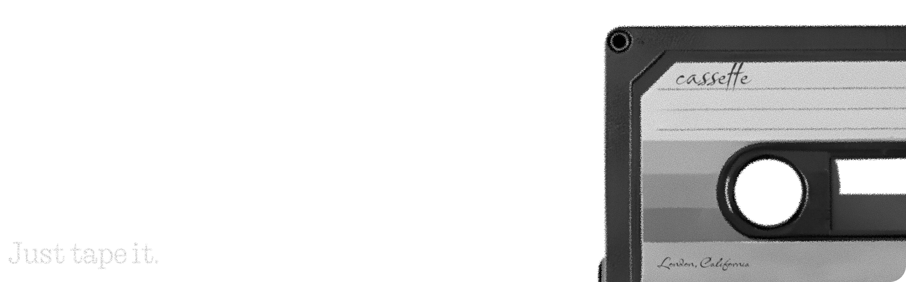

## Say Hello to **Cassette**  
Create stunning **Glyphtones** — easier than ever before.

## **Recommended System Requirements**  
To ensure a smooth experience, we recommend running Cassette on the following system:

- **Memory**: 8 GB RAM or more  
- **Processor**: 4 Core CPU
- **Clock Speed**: 2.0 GHz or higher
- **Free Space**: 1 GB or more

## How to install?
Go to Releases page and download `Cassette.zip`
Unpack it and run `Cassette.bat`

## **Important Notes**  

- When launching **Cassette** for the first time, the app **may experience noticeable lag** while loading the initial ringtone. Please be patient — it gets better after the first run.  
- This is the **very first release**. Don’t expect perfection just yet — crashes, slowdowns, or glitches may occur. If you encounter bugs, please report them so we can improve!  
- Certain features are **not implemented yet**, including:
  - Segmented editor  
  - Undo/Redo functionality  
  - Glyph UI preview
  - Settings aren't working right now
  
  But don’t worry — they’re on the roadmap!

- **Real-time Preview on your Phone**  
  Just install the **Cassette Receiver** app on your Nothing Phone and enable **Android Debug Mode**, and connect your phone to PC by USB. Cassette will automatically detect your phone.
  Use USB-A to USB-C cable.
  * Was only tested on 3a.