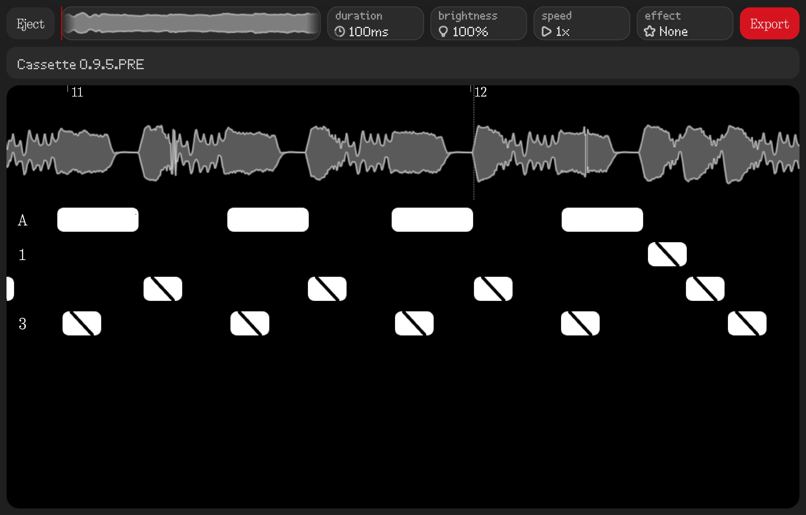
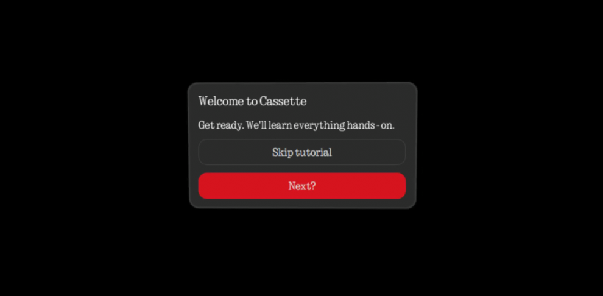
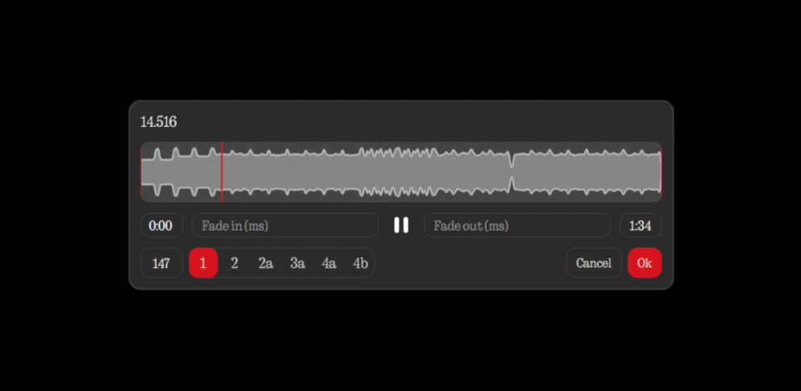
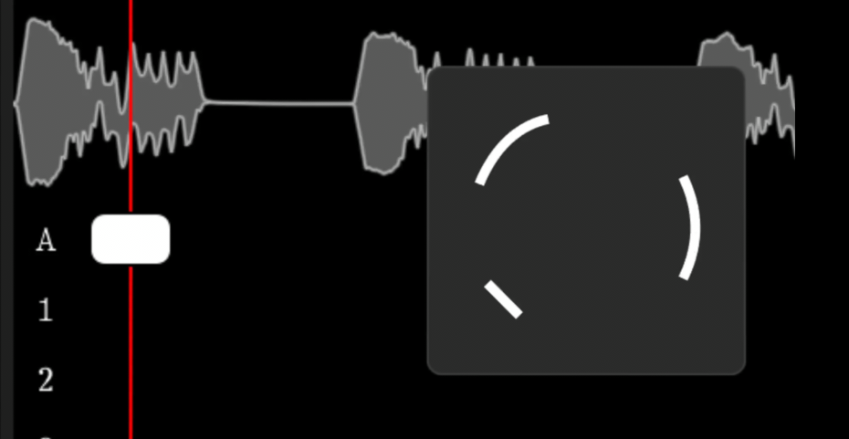
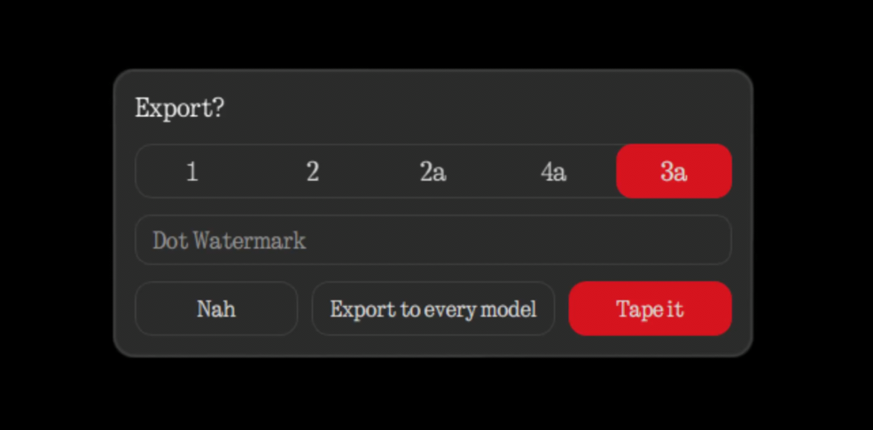
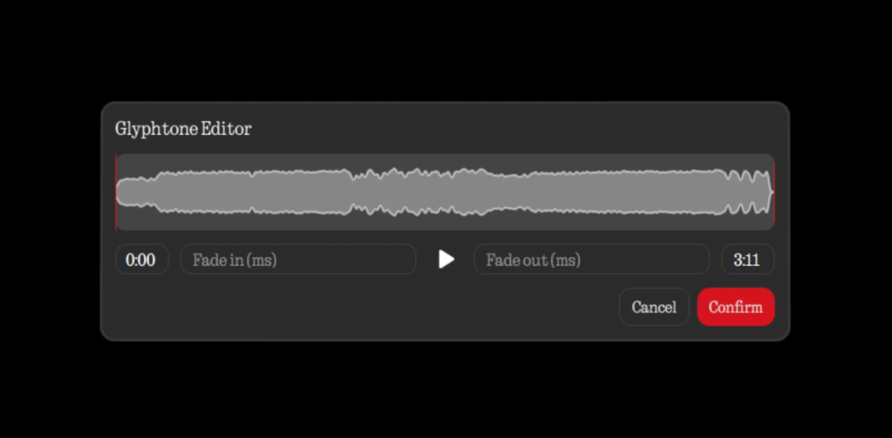
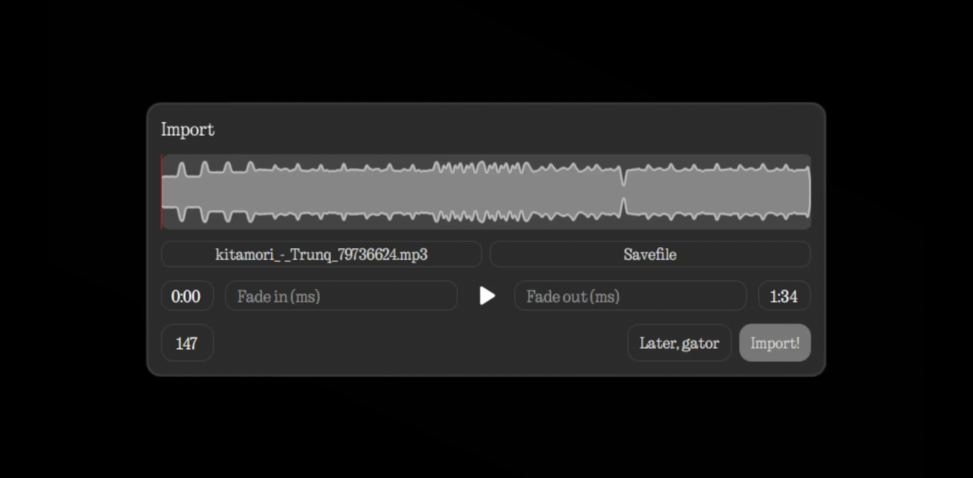

# Cassette

> An over - engineered, Glyph Composer for Nothing Phones.

## Overview

Most lighting editors treat LEDs like binary on / off states in a spreadsheet...

Meet **Cassette.** An editor built from the ground up to feel like a tactile hardware instrument.



## Core Features

### Available Phones
* Phone (1)
* Phone (2)
* Phone (2a)
* Phone (3a)
* Phone (4a)
* Phone (4b)

### Interactive Onboarding
* **"Do to Continue" Tutorial** - A hands - on onboarding sequence that guides you through real interactions before letting you into the workspace. Fully skippable if you already know the ropes.



### The Timeline & Lighting Engine
* **Keyframe Lighting Curves** - Switch any glyph into Keyframes mode (`Alt` + Click) to plot precise brightness envelopes over time. Adjust nodes across axes with smooth easing curves.

https://github.com/user-attachments/assets/4ea0798d-023e-48c5-a447-ee7fdab68367

* **Stacking & Peak Dominance Blending** - Glyphs can be placed directly on top of each other. The engine applies peak dominance logic - the highest brightness layer always takes visual priority, allowing multi - layer light blending on a single channel.

* **Stack Inspection** - Double - click any stacked cluster to fan it out and inspect or edit each glyph individually.

https://github.com/user-attachments/assets/cf447040-db70-4b8a-a2d0-eb63b59a6f66

* **Sub - Millisecond Waveform Slicing** - Fast ~0.5 s automatic BPM detection on import, sub - millisecond audio trimming, and customizable fade - in / fade - out envelopes.



* **Channel "A" (Global Track)** - A dedicated universal channel that triggers all phone zones simultaneously, allowing you to animate the entire device as one unified light source.



### Interface & Tactile Physics
* **Animations. They're everywhere. You will see it.**

https://github.com/user-attachments/assets/e820d6e8-95ae-497e-b845-95d4bab22bd4

https://github.com/user-attachments/assets/179374fe-b88d-482d-bf03-78d4f9be015b

https://github.com/user-attachments/assets/b83f87e4-1bbe-4ab4-89c8-c59ca864f451

## Nothing Phone Integration

* **Live USB Hardware Mirroring** - Connect your Nothing Phone via USB to mirror timeline playback straight onto the physical back panel in real time.

* **Cross - Model Porting** - Projects authored for one phone can be automatically compiled and adapted across supported models: Phone (1), Phone (2), Phone (2a), Phone (3a), Phone (4a), and Phone (4b).

* **The Dot - Matrix Signature** - When Nothing's system Composer renders preview dots, Cassette's compiler allows you to encode custom text (Latin, Cyrillic, numbers, and symbols) directly into that dot matrix as an author signature.



* **Standalone Glyphtone Trimmer** - Trim and re - export already - compiled `.ogg` glyphtone files directly without needing to rebuild project files.



* **Universal Importer** - Native project import from BNGC and Audacity formats.



---

## Engine & Performance

Under the hood runs **LoomEngine** - an internal animation driver:

* Handles overlapping state interruptions smoothly (e.g., aborting an action mid - transition)

* Complete offscreen and occlusion culling: glyphs concealed behind dominant layers or outside the viewport consume zero render passes.

* Hardware - accelerated OpenGL rendering with configurable MSAA (up to 8x) and NumPy / Pythran - optimized audio math.

* Built to maintain high frame rates even on entry - level hardware (tested on dual - core AMD 3020e configurations).

<video src=".github/playback.mp4" controls autoplay muted style="border-radius: 20px; overflow: hidden;"></video>

## Keyboard Shortcuts

| Shortcut | Action |
| :--- | :--- |
| `Space` | Play / Pause playback |
| `S` | Cycle playback speed (`1.0x` -> `0.5x` -> `0.2x`) |
| `D` | Quick duration editor for selected glyphs |
| `B` | Quick brightness editor |
| `[` / `]` | Nudge brightness (or shift keyframe envelopes up / down) |
| `Ctrl + D` | Duplicate selection |
| `Alt + Click` | Insert keyframe node on selected glyph |
| `Alt + RMB` | Remove keyframe node |
| `Eject` | Decelerate audio tape and return to project hub |

More in tutorial.

## Real - Time Phone Setup (USB Preview)

To preview light sequences directly on your device:

1. **Enable Developer Options & USB Debugging:**
   * Open `Settings` -> `About phone` -> tap `Build number` **7 times**.
   * Open `System` -> `Developer options` -> enable **USB debugging**.
2. **Connect via USB:**
   * Plug your phone into your computer using a data - capable USB cable.
   * When prompted on your phone screen, authorize the computer connection (select *"Always allow from this computer"*).
3. **Automatic Link:**
   * Launch Cassette. The app detects the connected device and will prompt to install the lightweight companion receiver automatically.
   * Play the timeline to view synced lighting on the physical phone back.

## Audio Latency Calibration

Different operating systems and audio drivers introduce distinct latency buffers. 

To calibrate sync:
* Open `Settings` -> `Audio` -> **Audio Latency Calibration**.
* Tap `Space` to the rhythmic beat prompt to align waveform visuals with audio playback down to the exact millisecond.

---

## Installation

Download the latest precompiled binaries from the **[Releases Page](https://github.com/chips047/Cassette/releases)**.

### Windows
Unpack the archive and launch:
```text
Cassette.exe
```

### Linux
Unpack the archive, ensure execution permissions, and run:
```bash
chmod +x Cassette
./Cassette
```

## System Requirements

* **Operating System:** Windows 10/11 (64 - bit / ARM), MacOS (Silicon / Intel), Linux (64 - bit / ARM)
* **Memory:** 4 GB RAM minimum (8 GB recommended)
* **Graphics:** OpenGL 3.3+ capable hardware
* **Disk Space:** 300 MB free space

## Community & Feedback

* **Author:** `chips047` on Discord
* **Bugs & Feature Requests:** Please open an issue via the GitHub tracker.
